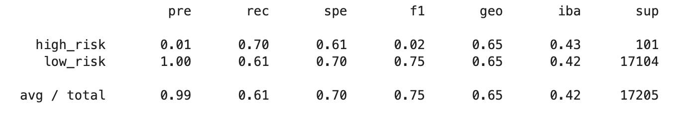
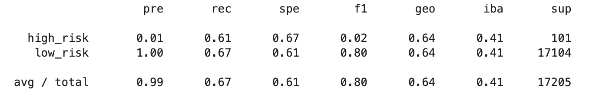
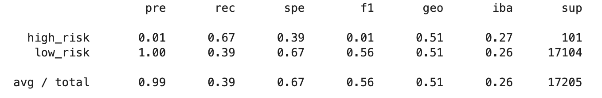
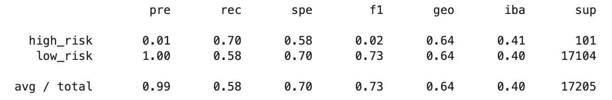
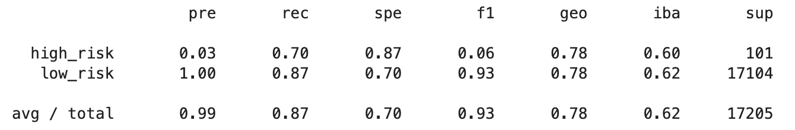
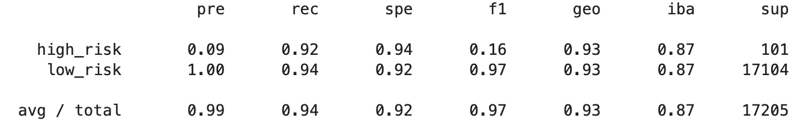

# Credit Risk Analysis

## Overview

The purpose of this project is to compare different methods of data resampling and classification for predicting credit risk. The data used for the project is a 2019 credit card credit dataset from LendingClub, a peer-to-peer lending services company. Given that our data for credit risk is inherently an unbalanced classification problem, with low-risk credit profiles far outnumbering high-risk credit profiles, we compared different methods of training and evaluating models with unbalanced classes.

Using the imbalanced-learn and scikit-learn Python libraries, we tried different methods of resampling the data to achieve class balance with our training data for a Logistic Regression classification model. We tested two oversampling methods: Naive Random Oversampling and SMOTE (Synthetic Minority Over-sampling Technique). We tested the Cluster Centroids method for undersampling the data. We also tested the SMOTEENN (Synthetic Minority Over-sampling Technique and Edited Nearest Neighbours) method for a combined approach of oversampling and undersampling.

Lastly, we tested 2 different classification methods using ensemble classifiers. The two ensemble learners used for prediciting credit risk, using the imbalanced dataset, were the Balanced Random Forest Classifier and the Easy Ensemble Classifier.

## Results

Listed below, in each section, is the balanced accuracy, precision, and recall scores for each sampling method and machine learning model tested.

*The over-, under-, and combination sampling approaches below use the same Logistic Regression model design for training and predictions to compare results between the different sampling techniques.*

### Oversampling

**Naive Random Oversampling**
- balanced accuracy score: 65.4%
- high-risk
    - precision score: 1.0%
    - recall score: 70.0%
- low-risk
    - precision score: 100.0%
    - recall score: 61.0%
- Full Imbalanced Classification Report Ouput

**SMOTE**
- balanced accuracy score: 64.1%
- high-risk
    - precision score: 1.0%
    - recall score: 61.0%
- low-risk
    - precision score: 100.0%
    - recall score: 67.0%
- Full Imbalanced Classification Report Ouput

### Undersampling

**Cluster Centroids**
- balanced accuracy score: 53.2%
- high-risk
    - precision score: 1.0%
    - recall score: 67.0%
- low-risk
    - precision score: 100.0%
    - recall score: 39.0%
- Full Imbalanced Classification Report Ouput

### Combination (Over- and Under-) Sampling

**SMOTEENN**
- balanced accuracy score: 64.1%
- high-risk
    - precision score: 1.0%
    - recall score: 70.0%
- low-risk
    - precision score: 100.0%
    - recall score: 58.0%
- Full Imbalanced Classification Report Ouput

### Ensemble Learners

**Balanced Random Forest Classifier**
- balanced accuracy score: 78.9%
- high-risk
    - precision score: 3.0%
    - recall score: 70.0%
- low-risk
    - precision score: 100.0%
    - recall score: 87.0%
- Full Imbalanced Classification Report Ouput

**Easy Ensemble Classifier**
- balanced accuracy score: 93.2%
- high-risk
    - precision score: 9.0%
    - recall score: 94.0%
- low-risk
    - precision score: 100.0%
    - recall score: 92.0%
- Full Imbalanced Classification Report Ouput

## Summary

### Resampling with Logistic Regression Classifier

After testing 4 different methods of resampling with the Logistic Regression model, Naive Random Oversampling achieved the best balanced accuracy score of 65.4%. All Logistic regression models only achieved a 1.0% precision score. Both Naive Random Oversampling and SMOTEENN tied for the best high-risk class recall score, out of the sampling methods for the Logistic Regression model, with a 70% recall score.

### Ensemble Classifiers

Both ensemble learning prediction models tested gave better results than all 4 of the Logistic Regression models with different resampling methods. The Easy Ensemble Classifier model proved better than the Balanced Random Forest Classifier model in balanced accuarcy, high-risk precision, and high-risk recall scores. The Easy Ensemble Classifier achieved a 93.2% balanced accuracy score, a 9.0% precision score, and a 92.0% high-risk recall score.

### Recommended Classifier for Credit Risk Prediction

Ultimately, I would choose to recommend the Easy Ensemble Classifier for use in prediciting high or low credit risk, using our given LendingClub dataset for model training. Our current Easy Ensemble Classifier model is not perfect and could possibly be improved, with a more stringent feature selection in our data preprocessing for example. However, it may serve as a good starting point, and passable model for our use case as is.

There a few important justifications for choosing this model. While it is not ideal to have such a low precision score for our high-risk class, at 9.0% precision, our evaluation criteria should depend more heavily on the high-risk recall score, while maintaining an acceptable high-risk false positive rate for our use case.

Presumably, our purpose would be to predict credit card credit risk for an individual in order to decide whether or not they should be approved for future credit card use. If we are a credit card company who earns more revenue by approving mostly low-risk credit card applicants, we will want to maximize acceptances for low-risk credit applicants, while minimizing (if not eliminating entirely) acceptances of high-risk credit applicants.

Our Easy Ensemble Classifier has a small high-risk precision score because there are not many total high-risk data points (101) in the test set, meanwhile, there are, by comparison, many high-risk false positives (983) classified by the model. This means, that even if the model were to correctly predict all the high-risk classifications with 101 true positives, several hundred false positive classifications will deflate the high-risk precision score very quickly. Considering the imbalance of our classes this can be a very easy outcome to have. With a total of 17,104 total low-risk data points in the test set, a relatively small high-risk false positive rate will result in a very small high-risk precsion score. This is what we are observing in our current results. 

The high-risk false positive rate of the Easy Ensemble classifier is just 5.7%, however, this also means there are 983 high-risk false positives. This is what gives us the small high-risk precision score. Considering our use case may, for example, call for us to prioritize minimizing acceptance of high-risk credit applicants, our priority should be maximizing the recall score and obtaining as many high-risk true positives as possible with a reasonable false positive rate.

Out of all the models tested, the Easy Ensemble Classifier has both the highest high-risk recall score (92%) and the lowest high-risk false positive rate (5.7%). However, it should still be acknowledged that this may still not be a sufficient model if the lost revenue from denying 5.7% of actual low-risk applicants exceeds the lost revenue of accepting all high-risk applicants. If this were the case, it would have been more beneficial (to maximize revenue) to have done nothing, rather than select credit applicants based on this model's credit risk predictions. This revenue maximizing cost-benefit anaysis can change on a case-to-case basis, and further analysi, including the credit card companies financial data, would be needed. However, with the assumption that revenue lost from misclassification of 5.7% of actual low-risk credit applicants is exceeded by the regained revenue of denying 92% of actual high-risk credit applicants, we can recommend the current Easy Ensemble Classifier as a useful model for credit risk prediction.  